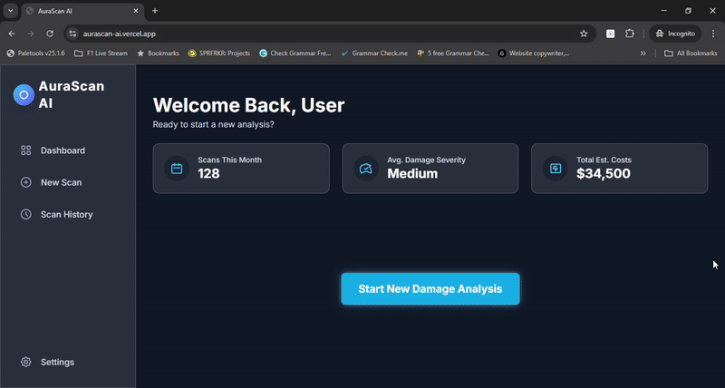
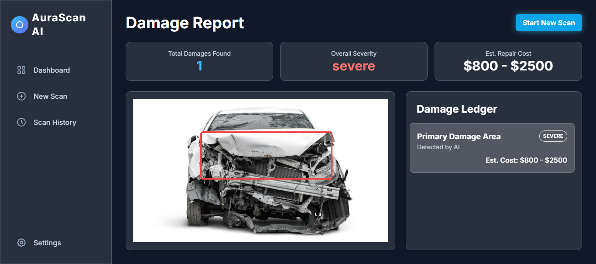

<div align="center">
  <h1>AuraScanAI - Frontend Application</h1>
</div>

<p align="center">
  
  
  
  
</p>

This repository contains the complete frontend for the AuraScanAI project, a modern, AI-powered web application for vehicle damage assessment. The interface is built with **React and TypeScript**, providing a fast, responsive, and intuitive user experience for interacting with the powerful AI backend.

---

## 🚀 Live Demo & Showcase

**Live Application:** **[aurascan-ai.vercel.app](https://aurascan-ai.vercel.app/)**

### Live Demo in Action

<p align="center"><em>Live demo of the full analysis workflow: from image upload to the final, data-driven damage report.</em></p>

### Final Application Screenshot


---

## 🌐 Project Ecosystem

*   **Live Backend API:** [Hugging Face Spaces](https://huggingface.co/spaces/ehsanulhaque92/AuraScanAI)
*   **Backend Source Code:** [MdEhsanulHaqueKanan/aurascan-api](https://github.com/MdEhsanulHaqueKanan/aurascan-api)

---

## ✨ Key Features

*   **Modern, Responsive UI:** A stunning, futuristic interface designed with a glassmorphism aesthetic that looks great on all screen sizes, from mobile to desktop.
*   **Interactive File Upload:** Features an intuitive drag-and-drop file upload system for a seamless user experience.
*   **Live AI Analysis:** Seamlessly communicates with the deployed backend API to deliver a detailed damage analysis in real-time.
*   **Dynamic Data Visualization:** The Damage Report page is fully dynamic, populating all stat cards, the damage ledger, and a visual bounding box directly from the live AI response.
*   **Component-Based Architecture:** Built with a professional, reusable component structure using React, making the codebase clean and scalable.
*   **Type-Safe Codebase:** Written in TypeScript to ensure robustness, reduce runtime errors, and improve the developer experience.

---

## 🚀 Run Locally

**Prerequisites:** [Node.js](https://nodejs.org/) (version 16 or higher) installed on your system.

### 1. Clone the Repository

```bash
git clone https://github.com/MdEhsanulHaqueKanan/aurascan-frontend.git
cd aurascan-frontend
```

### 2. Install Dependencies
This will download all the necessary packages for the project.

```bash
npm install
```

3. Run the Development Server
This command starts the local Vite development server.

```bash
npm run dev
```

4. Open the App
Open your web browser and navigate to the local URL provided in the terminal (usually http://localhost:5173).

**Important:** For the application to function correctly, the [AuraScanAI backend server](https://github.com/MdEhsanulHaqueKanan/aurascan-api) must be running. The frontend's API target URL is configured in the `src/services/auraScanService.ts` file to point to the live Hugging Face deployment.